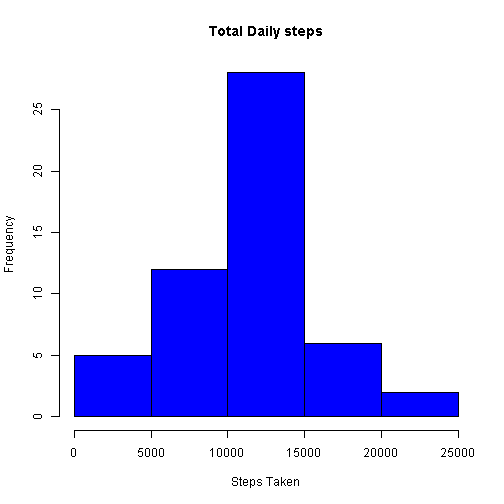
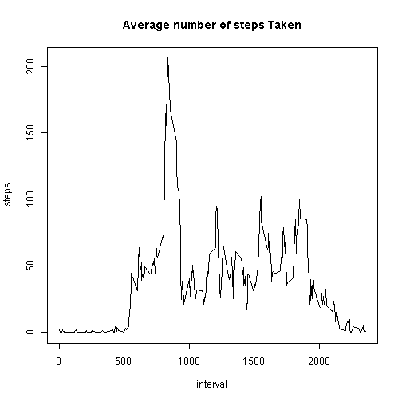
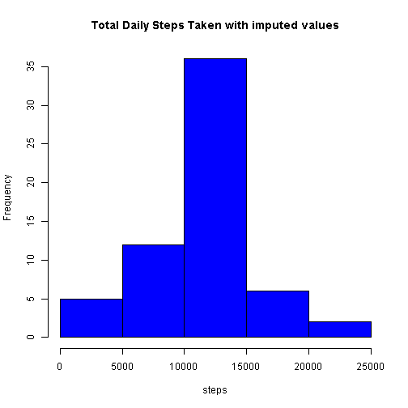
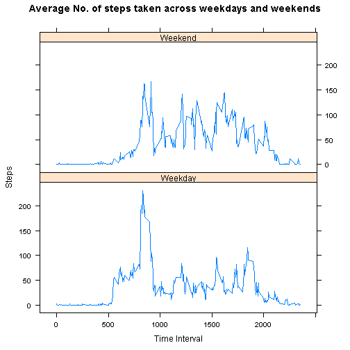

## Code for reading in the dataset and/or processing the data
Reads the csv file and gives a basic summary about the dataset.

```r
activity <- read.csv("activity.csv")
head(activity)
```

```
##   steps       date interval
## 1    NA 2012-10-01        0
## 2    NA 2012-10-01        5
## 3    NA 2012-10-01       10
## 4    NA 2012-10-01       15
## 5    NA 2012-10-01       20
## 6    NA 2012-10-01       25
```

```r
str(activity)
```

```
## 'data.frame':	17568 obs. of  3 variables:
##  $ steps   : int  NA NA NA NA NA NA NA NA NA NA ...
##  $ date    : chr  "2012-10-01" "2012-10-01" "2012-10-01" "2012-10-01" ...
##  $ interval: int  0 5 10 15 20 25 30 35 40 45 ...
```

```r
summary(activity)
```

```
##      steps            date              interval     
##  Min.   :  0.00   Length:17568       Min.   :   0.0  
##  1st Qu.:  0.00   Class :character   1st Qu.: 588.8  
##  Median :  0.00   Mode  :character   Median :1177.5  
##  Mean   : 37.38                      Mean   :1177.5  
##  3rd Qu.: 12.00                      3rd Qu.:1766.2  
##  Max.   :806.00                      Max.   :2355.0  
##  NA's   :2304
```

```r
step <- subset(activity, !is.na(activity$steps), na.rm = T)
```

## Histogram of the total number of steps taken each day
Calculates the sum of daily steps and Plots a Histogram for the same.

```r
stepsum <- aggregate(steps ~ date, step, sum)
head(stepsum)
```

```
##         date steps
## 1 2012-10-02   126
## 2 2012-10-03 11352
## 3 2012-10-04 12116
## 4 2012-10-05 13294
## 5 2012-10-06 15420
## 6 2012-10-07 11015
```

```r
hist(stepsum$steps, xlab = "Steps Taken", main = "Total Daily steps", col = "blue")
```



## Mean and median number of steps taken each day
Calculates the mean and median of number of steps taken each day.

```r
mn <- round(mean(stepsum$steps), 2)
mn
```

```
## [1] 10766.19
```

```r
md <- median(stepsum$steps)
md
```

```
## [1] 10765
```

## Time series plot of the average number of steps taken
Plots a line plot for time over average number of steps taken.

```r
averageSteps <- aggregate(steps ~ interval, activity, mean)
plot(averageSteps, type = "l", main = "Average number of steps Taken")
```



## The 5-minute interval that, on average, contains the maximum number of steps
Calculates the maximum number of steps taken on average, in 5 minute interval.

```r
maxSteps <- averageSteps[which.max(averageSteps$steps), ]$interval
maxSteps
```

```
## [1] 835
```

## Code to describe and show a strategy for imputing missing data
Imputing missing data

```r
sum(is.na(activity$steps))
```

```
## [1] 2304
```

```r
impute <- activity
index <- is.na(impute$steps)
avg <- tapply(step$steps, step$interval, mean)
impute$steps[index] <- avg[as.character(impute$interval[index])]
```

## Histogram of the total number of steps taken each day after missing values are imputed
Histogram plot for total number of steps taken each day after imputing missing values.

```r
new_stepsum <- aggregate(steps ~ date, impute, sum)
head(new_stepsum)
```

```
##         date    steps
## 1 2012-10-01 10766.19
## 2 2012-10-02   126.00
## 3 2012-10-03 11352.00
## 4 2012-10-04 12116.00
## 5 2012-10-05 13294.00
## 6 2012-10-06 15420.00
```

```r
hist(new_stepsum$steps, col = "blue", xlab = "steps", main = "Total Daily Steps Taken with imputed values")
```



## Panel plot comparing the average number of steps taken per 5-minute interval across weekdays and weekends
Plot for comparing average number of steps taken per 5 minute interval across weekdays and weekends using lattice plotting system.

```r
impute$weekdays <- weekdays(as.Date(impute$date))
impute$DayType <- ifelse(impute$weekdays == "Saturday"|impute$weekdays == "Sunday", "Weekend", "Weekday")
head(impute)
```

```
##       steps       date interval weekdays DayType
## 1 1.7169811 2012-10-01        0   Monday Weekday
## 2 0.3396226 2012-10-01        5   Monday Weekday
## 3 0.1320755 2012-10-01       10   Monday Weekday
## 4 0.1509434 2012-10-01       15   Monday Weekday
## 5 0.0754717 2012-10-01       20   Monday Weekday
## 6 2.0943396 2012-10-01       25   Monday Weekday
```

```r
library(lattice)
dayType_stepsum <- aggregate(steps ~ interval+DayType, impute, mean)

xyplot(steps ~ interval | DayType, dayType_stepsum, type = "l", layout = c(1, 2), xlab = "Time Interval", ylab = "Steps", main = "Average No. of steps taken across weekdays and weekends")
```


